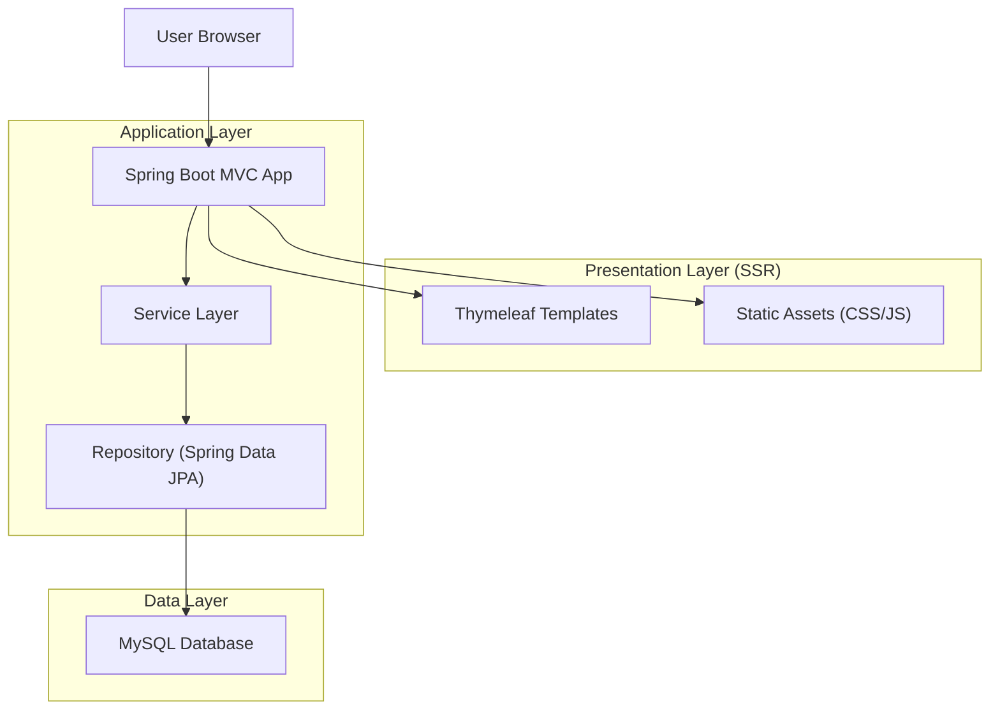
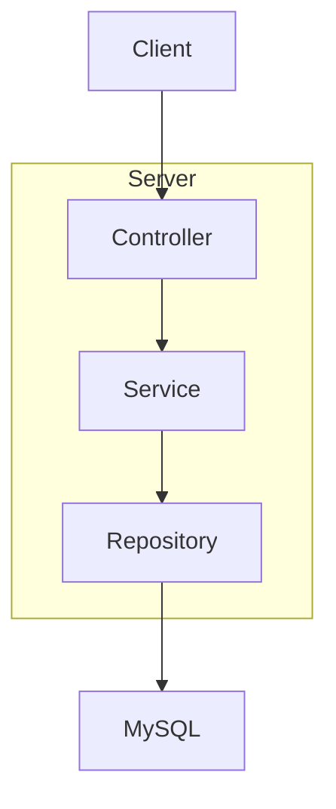
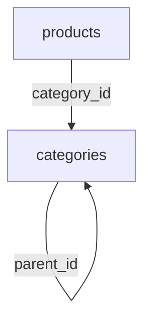

## 1.Architecture design


## 2.Technology Description
- Frontend (SSR): Thymeleaf templates + HTML + CSS (static)
- Backend: Spring Boot (Spring MVC) + Service layer + Spring Data JPA
- Database: MySQL

## 3.Route definitions
| Route | Purpose |
|---|---|
| / | Trang chủ (index) |
| /products | Danh sách sản phẩm |
| /products/new | Form thêm sản phẩm |
| /products/edit/{id} | Form sửa sản phẩm |
| /products/update/{id} | Submit cập nhật sản phẩm (POST) |
| /products/{id} | Chi tiết sản phẩm |
| /products/delete/{id} | Xoá sản phẩm (GET, hiện tại) |
| /categories/parents | Danh sách danh mục cha |
| /categories/parents/add | Form + submit thêm danh mục cha |
| /categories/parents/edit/{id} | Form sửa danh mục cha |
| /categories/parents/update/{id} | Submit cập nhật danh mục cha (POST) |
| /categories/parents/delete/{id} | Xoá danh mục cha (GET, hiện tại) |
| /categories/children | Danh sách danh mục con |
| /categories/children/add | Form + submit thêm danh mục con |
| /categories/children/edit/{id} | Form sửa danh mục con |
| /categories/children/update/{id} | Submit cập nhật danh mục con (POST) |
| /categories/children/delete/{id} | Xoá danh mục con (GET, hiện tại) |

## 4.API definitions (If it includes backend services)
Hệ thống hiện render view (không có REST API public). “Thông báo” nên triển khai bằng flash attribute (server-side) và render qua 1 fragment alert dùng chung.

## 5.Server architecture diagram (If it includes backend services)


## 6.Data model(if applicable)
### 6.1 Data model definition


### 6.2 Data Definition Language
Category Table (categories)
```
CREATE TABLE categories (
  id BIGINT PRIMARY KEY AUTO_INCREMENT,
  name VARCHAR(255) NOT NULL,
  image_url VARCHAR(1024),
  parent_id BIGINT
);
```

Product Table (products)
```
CREATE TABLE products (
  id BIGINT PRIMARY KEY AUTO_INCREMENT,
  name VARCHAR(255),
  price DOUBLE,
  description TEXT,
  image_url VARCHAR(1024),
  promotion_type VARCHAR(50),
  discount_percent DOUBLE,
  gift_description VARCHAR(1024),
  category_id BIGINT
);
```