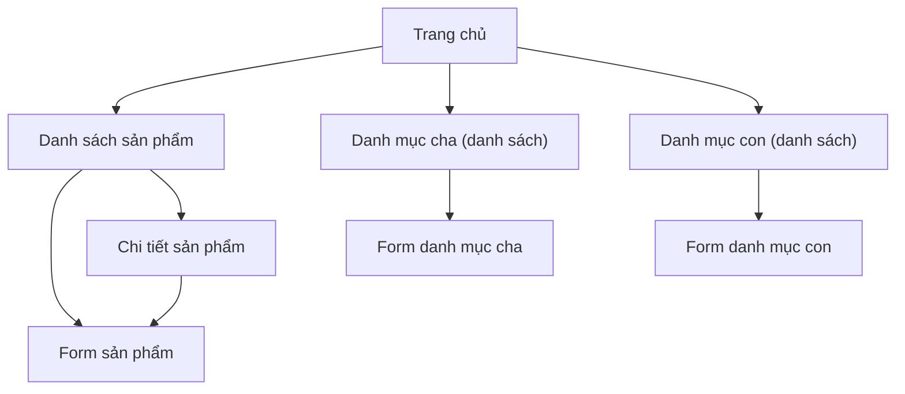

## 1. Product Overview
Cải thiện thẩm mỹ và tính đồng nhất UI cho các màn hình CRUD hiện có (Sản phẩm, Danh mục cha/con) trên PhuongDung Shop.
Mục tiêu: bảng/form/nút/thông báo dễ nhìn, nhất quán, giảm “inline style”, tăng khả dụng cho thao tác quản trị.

## 2. Core Features

### 2.1 Feature Module
Các trang thiết yếu hiện có cần chuẩn hoá UI:
1. **Trang chủ**: header đồng nhất; truy cập nhanh tới trang quản lý.
2. **Danh sách sản phẩm**: bảng dữ liệu; cột ảnh; nhóm nút hành động; trạng thái rỗng.
3. **Form sản phẩm (thêm/sửa)**: form theo lưới; validate; nút Lưu/Huỷ chuẩn.
4. **Chi tiết sản phẩm**: hiển thị thông tin; hành động quay lại / sửa.
5. **Danh mục cha (danh sách)**: bảng dữ liệu; hành động sửa/xoá.
6. **Form danh mục cha (thêm/sửa)**: form tối giản; lỗi field.
7. **Danh mục con (danh sách)**: bảng dữ liệu; hiển thị danh mục cha + ảnh.
8. **Form danh mục con (thêm/sửa)**: form có select danh mục cha; lỗi field.

### 2.2 Page Details
| Page Name | Module Name | Feature description |
|---|---|---|
| Dùng chung | Layout shell | Dùng chung header/footer; nội dung trong `.container`; tiêu đề trang + thanh hành động thống nhất. |
| Dùng chung | Hệ thống nút | Chuẩn hoá `Primary/Secondary/Destructive/Link`; trạng thái hover/disabled; dùng class thay vì style inline. |
| Dùng chung | Bảng (table) | Chuẩn hoá header sticky (tuỳ chọn), zebra row, căn lề số/tiền; cột hành động dạng group; hiển thị empty state. |
| Dùng chung | Form | Chuẩn hoá label, hint, error; bố cục 2 cột desktop; bắt buộc (`required`) hiển thị rõ. |
| Dùng chung | Thông báo | Hiển thị alert/toast cho: tạo/sửa/xoá thành công, lỗi validate; 1 khu vực message thống nhất trên đầu `main`. |
| Danh sách sản phẩm | Action bar | Nút “Thêm sản phẩm” dạng primary; breadcrumb: Trang chủ / Sản phẩm. |
| Danh sách sản phẩm | Product table | Hiển thị ảnh thumbnail chuẩn kích thước; link tên sang chi tiết; nút Sửa/Xoá có icon + khoảng cách. |
| Danh sách sản phẩm | Xoá an toàn | Trước khi xoá hiển thị confirm (modal/dialog) và/hoặc thông báo cảnh báo. |
| Form sản phẩm | Nhập liệu | Nhập tên/giá/ảnh/mô tả/danh mục; hiển thị lỗi field (nếu có); nút Lưu/Huỷ cố định. |
| Chi tiết sản phẩm | Trình bày | Layout 2 cột (ảnh + thông tin); nút “Sửa” (secondary) và “Quay lại”. |
| Danh mục cha/con | CRUD table + form | Cùng mẫu table/form như sản phẩm; nút thêm dạng primary; lỗi field thống nhất; xoá có confirm. |

## 3. Core Process
Luồng CRUD (quản trị):
- Danh sách → bấm Thêm/Sửa → nhập liệu → Lưu → quay lại danh sách và thấy thông báo thành công.
- Danh sách → bấm Xoá → xác nhận → xoá thành công → thông báo và cập nhật danh sách.

